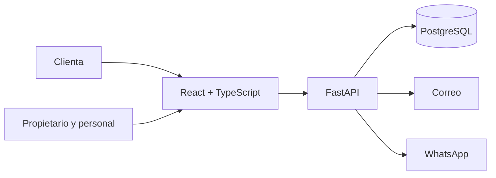

# BeautyHub ✨

> Gestión de citas para un negocio de belleza, diseñada desde reglas claras antes de escribir código.

BeautyHub es una aplicación web pública en desarrollo para simplificar la reservación y administración de citas de un negocio de belleza con presencia en **Chiconcuac** y **Texcoco**.

El proyecto busca reducir el trabajo manual, prevenir conflictos en la agenda y ofrecer a las clientas una experiencia sencilla, privada y confiable. Su desarrollo sigue un enfoque **Spec-Driven Development (SDD)**: cada comportamiento importante se define, revisa y aprueba antes de implementarse.

## Estado del proyecto

| Área | Estado |
| --- | --- |
| Especificación de citas y servicios | ✅ Aprobada |
| Especificación de autenticación administrativa | ✅ Aprobada |
| Planes técnicos | ✅ Aprobados |
| Tareas de implementación | ✅ Preparadas |
| Aplicación funcional | ⏳ Aún no iniciada |
| Publicación en producción | 🔒 Pendiente de revisión jurídica |

Actualmente, el repositorio contiene la definición funcional, las decisiones técnicas y el trabajo planificado. Todavía no incluye una aplicación ejecutable.

## La experiencia que queremos construir

### Para las clientas

- Consultar servicios activos por sucursal.
- Reservar una cita sin crear una cuenta.
- Elegir fecha y horario con disponibilidad real.
- Consultar, modificar o cancelar una cita mediante un código privado.
- Recibir confirmaciones y recordatorios transaccionales por correo y WhatsApp.
- Mantener sus datos protegidos y separados de los de otras clientas.

### Para el negocio

- Administrar una sola agenda para ambas sucursales y un único profesional.
- Evitar citas superpuestas y considerar los tiempos de traslado entre sucursales.
- Crear y administrar servicios, precios y periodos de indisponibilidad.
- Registrar citas completadas, cancelaciones e inasistencias.
- Trabajar con roles diferenciados para propietario y personal.
- Proteger el acceso administrativo mediante contraseña, TOTP y códigos de recuperación.
- Mantener un historial administrativo mínimo, auditable y sujeto a plazos de conservación.

## Reglas que distinguen a BeautyHub

La agenda se modela como una línea de tiempo única. No basta con comprobar que dos citas no se superpongan: también se consideran la duración del servicio, los bloqueos administrativos y la ubicación de cada cita.

- Los horarios de inicio se ofrecen cada 15 minutos, entre las 09:00 y las 19:00.
- Se reservan 5 minutos entre citas en la misma sucursal.
- Se reservan 25 minutos entre citas en sucursales diferentes.
- Una reservación pública requiere al menos 60 minutos de anticipación.
- Cada operación que modifica la agenda vuelve a validar el estado más reciente.
- Las solicitudes concurrentes no pueden producir una doble reservación.
- La zona horaria oficial es `America/Mexico_City`.

## Arquitectura prevista

BeautyHub se construirá como un **monolito modular**: una sola aplicación desplegable, con responsabilidades internas claramente separadas.



La lógica del negocio permanecerá independiente de la interfaz, la base de datos y los proveedores externos. Esto permitirá probar las reglas críticas sin depender del navegador ni de servicios de terceros.

## Stack aprobado

| Capa | Tecnología prevista |
| --- | --- |
| Backend | Python 3.14 y FastAPI |
| Frontend | React, TypeScript y Vite |
| Persistencia | PostgreSQL |
| Acceso a datos y migraciones | SQLAlchemy y Alembic |
| Pruebas de dominio e integración | pytest |
| Pruebas web de extremo a extremo | Playwright |
| Despliegue previsto | Railway, bajo un mismo dominio |

Las dependencias todavía no se han instalado. Sus versiones exactas se verificarán y fijarán cuando se autorice la primera tarea de implementación.

## Seguridad y privacidad desde el diseño

La seguridad no se considera una etapa posterior. Forma parte de las especificaciones y de los criterios de aceptación del proyecto.

- Ningún secreto, token o credencial se almacena en el repositorio.
- Toda entrada externa debe validarse.
- Las operaciones administrativas requieren autenticación y autorización en cada solicitud.
- Las clientas no necesitan una cuenta; cada cita utiliza un código privado con aleatoriedad criptográfica.
- Las contraseñas administrativas se protegerán con Argon2id.
- El segundo factor utilizará TOTP basado en un estándar abierto.
- Los enlaces temporales y códigos de recuperación son de un solo uso.
- Los datos personales, eventos y respaldos están sujetos a reglas explícitas de minimización y retiro.

El [aviso de privacidad](docs/aviso-privacidad.md) disponible en este repositorio es todavía un borrador. Debe completarse y recibir revisión antes de publicarse como aviso vigente del servicio.

## Desarrollo guiado por especificaciones

La fuente de verdad sigue esta jerarquía:

```text
Constitución → Spec aprobada → Plan aprobado → Implementación → Pruebas
```

Este orden evita que una decisión improvisada en el código cambie silenciosamente el comportamiento esperado. Si aparece una ambigüedad relevante, el trabajo se detiene hasta aclararla en el nivel correspondiente.

La IA puede apoyar el desarrollo, pero no sustituye la revisión humana: cada cambio debe ser pequeño, comprensible, trazable y verificable.

## Documentación principal

| Documento | Propósito |
| --- | --- |
| [Constitución](docs/constitution.md) | Principios innegociables del proyecto |
| [Spec 001](specs/001-manita_gato/spec.md) | Citas, servicios, disponibilidad y notificaciones |
| [Plan 001](specs/001-manita_gato/plan.md) | Diseño técnico para implementar la gestión de citas |
| [Tareas 001](specs/001-manita_gato/tasks.md) | Secuencia verificable de implementación |
| [Spec 002](specs/002-autenticacion_administrativa/spec.md) | Cuentas, autenticación, autorización e historial |
| [Plan 002](specs/002-autenticacion_administrativa/plan.md) | Diseño técnico de la seguridad administrativa |
| [Tareas 002](specs/002-autenticacion_administrativa/tasks.md) | Secuencia verificable para implementar la autenticación |
| [Aviso de privacidad](docs/aviso-privacidad.md) | Borrador sujeto a revisión y datos pendientes |

## Estructura actual

```text
BeautyHub/
├── docs/
│   ├── aviso-privacidad.md
│   └── constitution.md
├── specs/
│   ├── 001-manita_gato/
│   │   ├── spec.md
│   │   ├── plan.md
│   │   └── tasks.md
│   └── 002-autenticacion_administrativa/
│       ├── spec.md
│       ├── plan.md
│       └── tasks.md
├── AGENTS.md
├── .gitignore
└── README.md
```

La estructura crecerá gradualmente conforme se ejecuten las tareas aprobadas. No se añaden capas, dependencias o infraestructura sin una necesidad respaldada por las especificaciones.

## Próximos pasos

1. Autorizar e instalar el stack aprobado.
2. Preparar las estructuras base del backend y frontend.
3. Configurar PostgreSQL y las suites de pruebas.
4. Implementar las reglas de servicios, agenda y citas.
5. Implementar la autenticación y autorización administrativa.
6. Completar las integraciones de correo y WhatsApp.
7. Ejecutar las verificaciones de seguridad, privacidad y recorridos completos.
8. Resolver la revisión jurídica pendiente antes de publicar el sistema.

## Alcance consciente

El MVP no incluye pagos, anticipos, cuentas para clientas, múltiples profesionales, campañas promocionales, analítica publicitaria ni servicios recurrentes dentro de una misma cita. Mantener este límite permite concentrar el esfuerzo en una agenda confiable y una experiencia segura.

---

Proyecto en desarrollo por [Kenay5](https://github.com/Kenay5), construido con especificaciones explícitas, revisión humana y atención especial a la privacidad.
